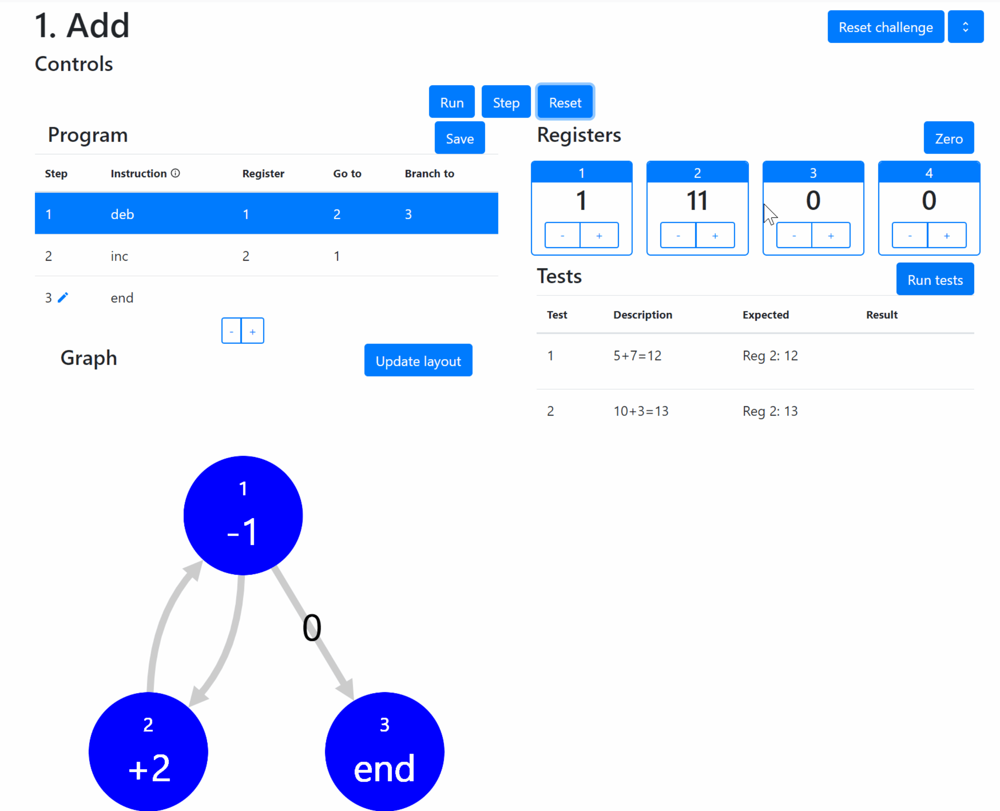

# Register Machine
A web app intended as an educational tool to introduce concepts
of computer programming, based on Wang's register machine [1], as discussed in
Ch. 24 of Dennett [2].  Text and the register machine problems draw on 
Dennett's work.   It is constructed with a brief tutorial, and a series of challenges
of increasing difficulty and new concepts.  Challenges are completed by successfully passing the tests supplied.  



Deployed via heroku at www.registermachine.com

Uses Vue for front-end with Django back-end. Configured for PostgreSQL.


## Register Machine Challenges

### Demo: Solving Challenge #2
[](https://youtu.be/9eTyqoDCcc4)
N.B. dropdowns didn' record in this screen recording

### Writing challenges
Challenges are written in YAML format, placed in `<project_root>/backend/challenges`.

Challenge YAML files are named ```challenge_<id>.yml``` where
```id``` is the integer challenge ID.  
See for example [Challenge 1](https://github.com/jsinkers/register-machine/blob/master/backend/challenges/challenge_01.yml)

Each time the app is deployed it checks for updates to the challenges and updates
the database accordingly.

The challenge YAML file should contain info on the challenge description, hints, registers,
and tests.

Skeleton `challenge_<id>.yml`:
```yaml
---
id: <id>
title: <challenge title>
statement: <html statement in quotes>
program: <see below>
tests: <see below>
registers: <see below>
hint: <html hint in quotes>
```
### Representation of register machine programs

Register machine programs are a JSON array of steps.  
```yaml
program:
- id: <int>                     # program step id
  instruction: <inc|deb|end>    # instruction for this step: increment, decrement/branch, or end
  register: <int>               # register ID to apply inc/dec to
  goTo: <int>                   # go-to step ID
  branchTo: <int>               # branch-to step ID (for decrement/branch)
  editable: <true|false>        # indicates whether this step is editable in the UI
  editMode: <true|false>        # flag to toggle edit mode on the step in the UI
```
         
### Representation of register machine program tests

Tests are represented in YAML as:
```yaml
tests: 
- id: <test id> 
  description: <brief test description>
  status: null      # indicates whether test has been passed.  should be stored as null
  initRegVals:      # stores register values at start of test
    - id:           # register id
      value:        # value of register <id>
  expectedRegVals:  # stores expected register values once test complete
    - id:
      value:
  actualRegVals:    # actual register values once test complete
    - id:
      value:
```

### Representation of registers

On page load, the number of registers listed in the YAML register list will be 
added to the register machine, and displayed with the values specified in the Challenge
YAML:
```yaml
registers:
- id: <int register id>
  value: <int initial value of register>
```

### Updating challenges
In order to update challenges on the database, run:
`$ heroku run python backend/manage.py runscript import_challenges`

## Architecture

Django back-end for API, models, and to serve the built Vue files
Vue front-end
Used parts of [django-vue-template](https://github.com/gtalarico/django-vue-template)
Local storage currently used to retain user progress.  

## Development server

From backend directory, Run django:
```python manage.py runserver```

From frontend directory, run Vue:
```npm run serve```

vue.config.js contains a proxy so that these do not clash.

## Deployment

### Heroku Procfile
* Collects static files into one location
* Performs database migrations
* Updates challenges
* Serves webapp

### Heroku setup

Heroku will build the Vue frontend with npm, and also install python dependencies.  

```bash
$ heroku apps:create register-machine
$ heroku git:remote -a register-machine
$ heroku buildpacks:add --index 1 heroku/nodejs
$ heroku buildpacks:add --index 2 heroku/python
$ heroku config:set DJANGO_SECRET_KEY='enter_secret_key'
$ heroku addons:create papertrail
$ git push heroku
```

Create superuser
```bash
$ heroku run python backend/manage.py createsuperuser
```

### Running heroku app locally

PostgreSQL must be installed to run this locally

On Windows, run:
```heroku local web -f Procfile.windows```

## Upcoming features

* playground to allow users to make their own programs to do anything they wish
* user accounts to allow permanent storage of solutions and playground programs
* layout improvements
* Vue tests

## References

1. Wang, H., 1957: "A variation to Turing's Theory of Computing Machines." *Journal
of the Association for Computing Machinery*, pp. 63-92. 
2. Dennett, D., 2013, *Intuition pumps and other tools for thinking.*
